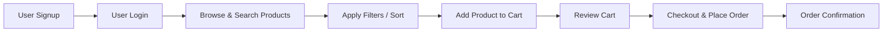
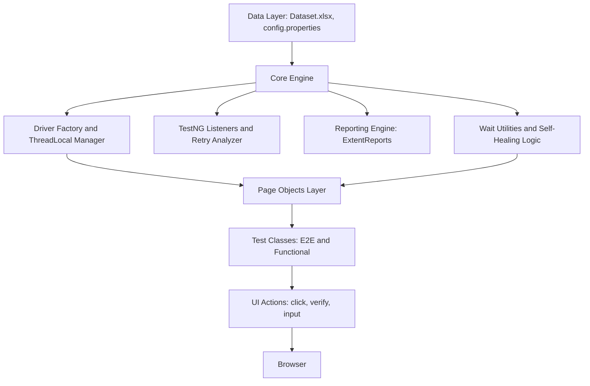
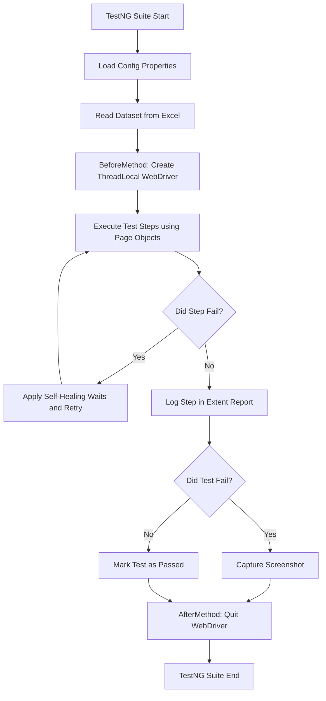
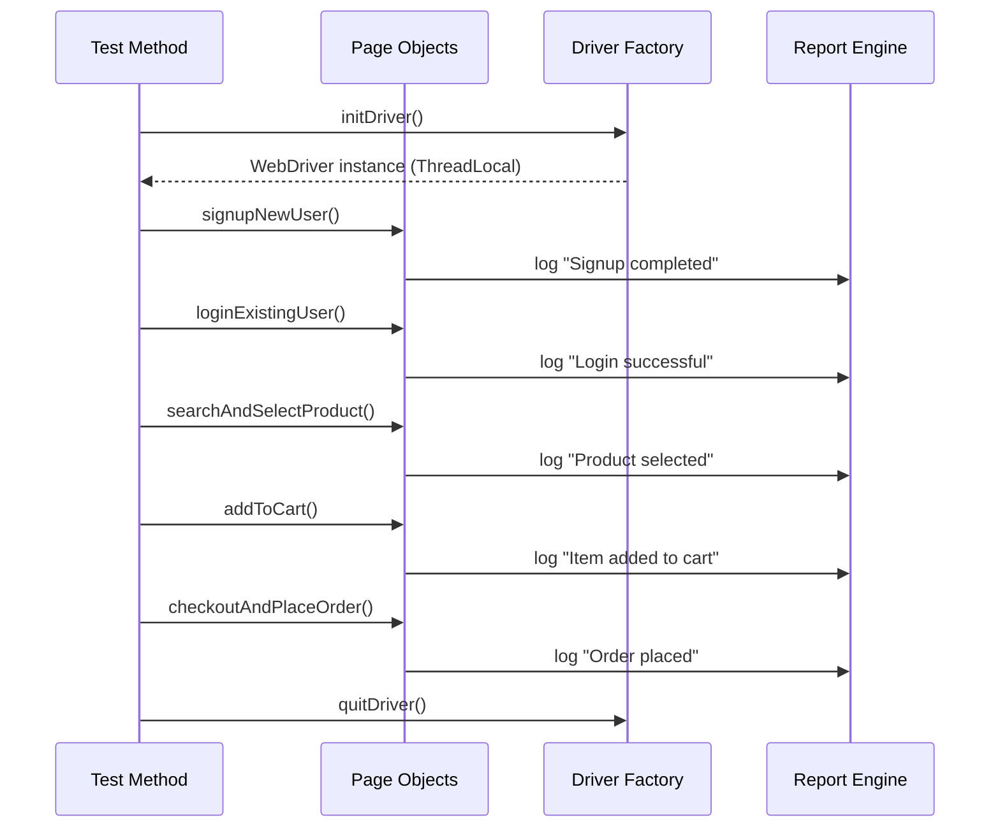

# QKart Enterprise Test Automation Framework

Enterprise-grade, data-driven, self-healing **UI test automation framework** for the QKart e‑commerce platform.  
This README is written from an **architect’s point of view** to give a clear, end‑to‑end understanding of how the framework works.

---

## 1. Goals of the Framework

UI automation for modern web apps (like QKart) usually suffers from:

- Flaky tests due to dynamic DOM updates
- Shared WebDriver instances in parallel runs
- Hard‑coded test data
- Poor reporting and debugging experience
- Slow execution and brittle waits

**This framework is designed to solve all of these:**

- Thread‑safe WebDriver using `ThreadLocal`
- Self‑healing wrappers for stale / intercepted elements
- Excel‑driven test data (`Dataset.xlsx`)
- ExtentReports HTML reporting with screenshots
- Clean Page Object Model (POM) and layered architecture
- Easy integration into CI/CD

---

## 2. End‑to‑End Business Flow Coverage (QKart)

The framework automates the full customer journey:



Every major step is validated with assertions, logs, and (on failure) screenshots.

---

## 3. Layered Architecture 
This section shows how the different layers of the framework interact.



### Layer Summary

- **Data Layer**  
  Stores all externalized inputs and configuration (URL, browser, timeouts, credentials, test data, etc.).

- **Core Engine**  
  Cross‑cutting framework services:
  - WebDriver lifecycle and `ThreadLocal` management
  - Listeners and retry policies
  - Reporting engine configuration
  - Smart waits and self‑healing utilities

- **Business Logic Layer (POM)**  
  Encapsulates page‑specific locators and actions:
  - `SignupPage`, `LoginPage`, `SearchPage`, `CartPage`, `CheckoutPage`, etc.
  - Exposes readable business methods like `signupNewUser()`, `addProductToCart()`, `placeOrder()`.

- **Test Layer**  
  Contains the actual TestNG test classes:
  - E2E flows
  - Modular / regression tests
  - Uses only Page Objects (never raw WebDriver).

---

## 4. Test Execution Lifecycle (Visual Flow)



---

## 5. Sequence View for a Typical E2E Scenario



---

## 6. Project Structure

```text
src/test/java/com/qkart
├── constants        # Static texts, URLs, messages
├── driver           # DriverFactory, ThreadLocal manager
├── enums            # Browser types, wait strategies, etc.
├── listeners        # TestNG listeners, retry analyser
├── pages            # All Page Object classes
├── reports          # ExtentReport manager / util
├── tests            # TestNG test classes (E2E + feature-wise)
└── utils            # Excel reader, waits, screenshots, helpers

src/test/resources
├── config.properties
├── log4j2.xml
└── Dataset.xlsx
```

---

## 7. Core Technical Concepts

### 7.1 Thread‑Safe WebDriver

- Implemented using `ThreadLocal<WebDriver>`
- Each test method running in parallel gets its **own** browser session
- Prevents:
  - Cross‑test interference
  - Random failures due to shared drivers

### 7.2 Self‑Healing & Wait Utilities

- Wraps Selenium actions with:
  - Explicit waits (visibility, clickability)
  - Retry logic for `StaleElementReferenceException`, `ElementClickInterceptedException`, etc.
- Reduces flaky failures on:
  - Dynamic React updates
  - Lazy‑loaded elements

### 7.3 Data‑Driven Testing

- All key inputs come from `Dataset.xlsx`
- You can:
  - Add new test scenarios without changing code
  - Maintain test data centrally
  - Support multiple environments by combining Excel + `config.properties`

### 7.4 Reporting

- **ExtentReports HTML** output
  - Test-, class-, and suite‑level views
  - Screenshots embedded for failed steps
  - Logs from listeners
- Ideal for:
  - Sharing with stakeholders
  - Debugging CI failures

---

## 8. Execution Guide

### 8.1 Run Tests in Parallel

```bash
mvn clean test -DsuiteXmlFile=testng_parallel.xml
```

### 8.2 Run Tests Sequentially

```bash
mvn clean test -DsuiteXmlFile=testng_sequential.xml
```

### 8.3 From IntelliJ IDEA

- Right‑click on any `testng_*.xml`
- Select **Run 'testng_*.xml'**

---

## 9. Configuration

Example `config.properties`:

```properties
url=https://crio-qkart-frontend-qa.vercel.app
browser=chrome
headless=false
implicitWait=15
```

You can extend this with:

- `grid.enabled=true/false`
- `remote.url=http://localhost:4444/wd/hub`
- `report.path=reports/QKartReport.html`

---

## 10. Reports Location

After a run, the HTML report is typically available at:

```text
reports/QKartReport.html
```


---

## 11. Author

**Natarajan M – SDET**  
Designing scalable, maintainable automation frameworks for modern web applications.
